<svg width="100%" viewBox="0 0 900 250" fill="none" xmlns="http://www.w3.org/2000/svg">
  <defs>
    <linearGradient id="nameGrad" x1="0%" y1="0%" x2="100%" y2="0%">
      <stop offset="0%" stop-color="#38bdf8">
        <animate attributeName="stop-color" values="#38bdf8;#818cf8;#38bdf8" dur="6s" repeatCount="indefinite"/>
      </stop>
      <stop offset="100%" stop-color="#818cf8">
        <animate attributeName="stop-color" values="#818cf8;#34d399;#818cf8" dur="6s" repeatCount="indefinite"/>
      </stop>
    </linearGradient>
    <linearGradient id="barGrad" x1="0%" y1="0%" x2="100%" y2="0%">
      <stop offset="0%" stop-color="#38bdf8" stop-opacity="0"/>
      <stop offset="50%" stop-color="#38bdf8"/>
      <stop offset="100%" stop-color="#818cf8" stop-opacity="0"/>
    </linearGradient>
    <clipPath id="typeCmd">
      <rect x="40" y="80" width="0" height="30">
        <animate attributeName="width" from="0" to="130" dur="1.2s" begin="0.5s" fill="freeze" calcMode="discrete"
          values="0;18;36;54;72;90;108;130" keyTimes="0;0.14;0.28;0.42;0.56;0.7;0.84;1"/>
      </rect>
    </clipPath>
    <clipPath id="typeName">
      <rect x="40" y="118" width="0" height="52">
        <animate attributeName="width" from="0" to="640" dur="1.4s" begin="2s" fill="freeze"/>
      </rect>
    </clipPath>
  </defs>

  <!-- terminal window -->
  <rect x="8" y="8" width="884" height="234" rx="14" fill="#0d1117" stroke="#30363d" stroke-width="1.5"/>

  <!-- title bar -->
  <rect x="8" y="8" width="884" height="40" rx="14" fill="#161b22"/>
  <rect x="8" y="34" width="884" height="14" fill="#161b22"/>
  <circle cx="34" cy="28" r="6.5" fill="#ff5f56"/>
  <circle cx="56" cy="28" r="6.5" fill="#ffbd2e"/>
  <circle cx="78" cy="28" r="6.5" fill="#27c93f"/>
  <text x="450" y="33" text-anchor="middle" font-family="Consolas, 'Courier New', monospace" font-size="14" fill="#8b949e">yousif@team-axioms: ~</text>

  <!-- prompt line -->
  <text x="40" y="102" font-family="Consolas, 'Courier New', monospace" font-size="20" fill="#34d399">$</text>
  <g clip-path="url(#typeCmd)">
    <text x="58" y="102" font-family="Consolas, 'Courier New', monospace" font-size="20" fill="#c9d1d9">whoami</text>
  </g>

  <!-- name output -->
  <g clip-path="url(#typeName)">
    <text x="40" y="158" font-family="'Segoe UI', Ubuntu, Helvetica, Arial, sans-serif" font-size="42" font-weight="700" fill="url(#nameGrad)">Muhammad Yousif Khan</text>
  </g>

  <!-- role line -->
  <text x="40" y="192" font-family="Consolas, 'Courier New', monospace" font-size="17" fill="#8b949e" opacity="0">
    Full-Stack Developer · Co-Founder &amp; Team Lead @ Team Axioms
    <animate attributeName="opacity" from="0" to="1" dur="0.6s" begin="3.4s" fill="freeze"/>
  </text>

  <text x="40" y="218" font-family="Consolas, 'Courier New', monospace" font-size="17" fill="#c9d1d9" opacity="0">
    <tspan fill="#34d399">$</tspan> building software businesses depend on
    <animate attributeName="opacity" from="0" to="1" dur="0.5s" begin="4s" fill="freeze"/>
  </text>
  <!-- blinking cursor -->
  <rect x="455" y="203" width="10" height="19" fill="#38bdf8" opacity="0">
    <animate attributeName="opacity" values="0;1" dur="0.1s" begin="4.1s" fill="freeze"/>
    <animate attributeName="opacity" values="1;0;1" dur="1.1s" begin="4.3s" repeatCount="indefinite"/>
  </rect>

  <!-- accent bar -->
  <rect x="40" y="232" width="820" height="2.5" rx="1.25" fill="url(#barGrad)"/>
</svg>

  

---

## 🚀 About Me

- 🏢 **Co-Founder & Team Lead @ Team Axioms** — a student-led dev team shipping full-stack web & AI automation for business clients.
- 🧾 Designed and deployed **4 production systems** — two multi-branch ERPs, a real-estate platform, and a retail POS, currently handling **85+ live transactions a day** with automated WhatsApp billing and double-entry accounting.
- ⚡ Automate with **n8n + LLM agents (LangChain)** — cut manual processing time by **40%** and removed **15+ hours/week** of recurring work.
- 🎓 BS Computer Science @ **Sukkur IBA University** (CGPA 3.37/4.00, Class of 2027).
- 🥇 **1st Place**, Speed Programming Competition (Sukkur IBA) · 🇮🇹 Global Semester Exchange — Sapienza University of Rome.
- 💬 Ask me about: **ERP/POS architecture, MERN, TypeScript, and workflow automation**.

---

## 🧩 Featured Work

| 🚀 Project | 🛠️ Tech Stack | 📊 Status |
|---|---|---|
| **Autos & Battery Store ERP**   *MERN ERP with WhatsApp Cloud API billing & double-entry accounting* | React · Node · MongoDB | 🟢 Live & In Use |
| **Fertilizer Shop ERP**   *Multi-branch, role-based retail ERP with 9 report types* | React 19 · TypeScript · Zustand | 🟢 Live & In Use |
| **Real Estate Management**   *Multi-city property platform with real-time WhatsApp alerts* | React · TypeScript · OpenWA | 🟢 Live & In Use |
| **CareerMint — AI Resume Builder**   *MERN SaaS with LLM parsing & ATS templates* | React · Node · MongoDB | 🚀 SaaS Platform |
| **Super Mart POS**   *Retail POS with real-time inventory sync & credit ledgers* | React · Node · Supabase | 🟢 Live & In Use |

*➡️ More projects on my [Portfolio](https://yousif-s-portfolio.vercel.app).*

---

## 💻 Tech Stack

**Languages**

**Frontend**

**Backend, Databases & Cloud**

**Data, AI & Tools**

     

---

## 📊 GitHub Analytics

  

  

  

---

