  

---

## 🚀 About Me

- 🏢 **Co-Founder & Team Lead @ Team Axioms** — a student-led dev team shipping full-stack web & AI automation for business clients.
- 🧾 Designed and deployed **4 production systems** — two multi-branch ERPs, a real-estate platform, and a retail POS, currently handling **85+ live transactions a day** with automated WhatsApp billing and double-entry accounting.
- ⚡ Automate with **n8n + LLM agents (LangChain)** — cut manual processing time by **40%** and removed **15+ hours/week** of recurring work.
- 🎓 BS Computer Science @ **Sukkur IBA University** (CGPA 3.37/4.00, Class of 2027).
- 🥇 **1st Place**, Speed Programming Competition (Sukkur IBA) · 🇮🇹 Global Semester Exchange — Sapienza University of Rome.
- 💬 Ask me about: **ERP/POS architecture, MERN, TypeScript, and workflow automation**.

---

## 🔭 Currently Building

<table>
	<tr>
		<td width="50%" valign="top">
			<h3 align="center">🌾 Kisaan.ai</h3>
			
<em>Voice-first AI farming assistant for Sindh's smallholder farmers</em>

			
Final Year Project — crop disease detection with CNNs, an Urdu/Sindhi voice assistant, and satellite vegetation health monitoring (Sentinel-2 / NDVI via Google Earth Engine). Weather and flood-risk alerts plus crop and profit recommendations, designed offline-first for low-literacy users.

			

				
				
				
			

		</td>
		<td width="50%" valign="top">
			<h3 align="center">🔬 Axiom Research Console</h3>
			
<em>Full-stack AI research console with an autonomous multi-stage pipeline</em>

			
Autonomous research runs streamed live over server-sent events: query decomposition, retrieval over ChromaDB vector storage, and staged synthesis. FastAPI backend with a React 19 + Redux Toolkit + TypeScript frontend.

			

				
				
				
			

		</td>
	</tr>
</table>

---

## 🧩 Featured Work

| 🚀 Project | 🛠️ Tech Stack | 📊 Status |
|---|---|---|
| **Autos & Battery Store ERP**   *MERN ERP with WhatsApp Cloud API billing & double-entry accounting* | React · Node · MongoDB | 🟢 Live & In Use |
| **Fertilizer Shop ERP**   *Multi-branch, role-based retail ERP with 9 report types* | React 19 · TypeScript · Zustand | 🟢 Live & In Use |
| **Real Estate Management**   *Multi-city property platform with real-time WhatsApp alerts* | React · TypeScript · OpenWA | 🟢 Live & In Use |
| **CareerMint — AI Resume Builder**   *MERN SaaS with LLM parsing & ATS templates* | React · Node · MongoDB | 🚀 SaaS Platform |
| **Super Mart POS**   *Retail POS with real-time inventory sync & credit ledgers* | React · Node · Supabase | 🟢 Live & In Use |

*➡️ More projects on my [Portfolio](https://yousif-s-portfolio.vercel.app).*

---

## 💻 Tech Stack

<b>🧰 View full stack — languages, frontend, backend, AI & tools</b>

 

**Languages**

**Frontend**

**Backend, Databases & Cloud**

**Data, AI & Tools**

     

---

## 📊 GitHub Analytics

<b>📈 View stats, streak, languages & activity graph</b>

 

  

  

  

<picture>
	<source media="(prefers-color-scheme: dark)" srcset="https://raw.githubusercontent.com/MuhammadYousifKhan/MuhammadYousifKhan/output/pacman-contribution-graph-dark.svg">
	<source media="(prefers-color-scheme: light)" srcset="https://raw.githubusercontent.com/MuhammadYousifKhan/MuhammadYousifKhan/output/pacman-contribution-graph.svg">
	
</picture>

  

<!-- TODO: Uncomment after WakaTime setup — replace WAKATIME_USERNAME -->
<!--  -->

---

## 🤝 Work With Me

<table>
	<tr>
		<td align="center" width="33%">
			<h3>🏗️ ERP & POS Systems</h3>
			
Multi-branch retail ERPs, inventory & credit ledgers, double-entry accounting, role-based reporting.

		</td>
		<td align="center" width="33%">
			<h3>💬 WhatsApp Automation</h3>
			
Automated billing, real-time alerts, and customer flows on the WhatsApp Cloud API & OpenWA.

		</td>
		<td align="center" width="33%">
			<h3>🤖 AI Integration</h3>
			
LLM agents, n8n workflow automation, and RAG pipelines that remove hours of manual work weekly.

		</td>
	</tr>
</table>

With **Team Axioms** I ship production systems for real businesses — 4 systems currently live, handling 85+ transactions a day. If you have a project in mind:

---

